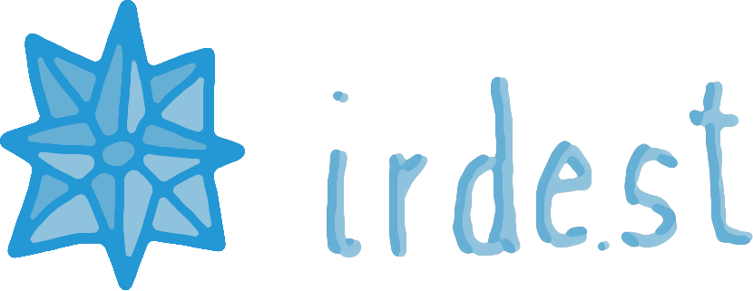

---

**irdest** is a decentralised networking project, aiming to create
easy-to-use solutions for ad-hoc wireless communication.  It supports
many common desktop operating systems (Linux, Windows, MacOS, BSD, …),
and Android mobile phones.  iOS support is on the roadmap.

**irdest** is both a cross-platform application, implementing
**messaging**, **filesharing**, and **voice calls**, but also a
**development toolkit** to create fully decentralised third-party
applications.

In order to be able to run on unpriviledged mobile platforms irdest
implements **decentralised routing protocols** and utilities entirely
in userspace.  The codebase is largely written in
[Rust](https://rustlang.org), with only a few compatibility components
being written in more platform specific languages.  All parts of the
project are contained in this repository.

Following is an overview of the available components.  Components have
additional information in their respective README files.

| Component  | Description                                                                                                                      |
|------------|----------------------------------------------------------------------------------------------------------------------------------|
| [clients]  | irdest end-user applications for various platforms                                                                               |
| [docs]     | Manuals (for both users and developers), and tools to build and deploy documentation                                             |
| [emberweb] | Cross-platform web interface bundled in with various user clients                                                                |
| [libqaul]  | Core library of the irdest ecosystem.  Provides networking abstractions, user management and discovery                           |
| [licenses] | Set of license texts that are in use in this repository                                                                          |
| [netmods]  | Platform-specific networking interface drivers                                                                                   |
| [nix]      | [Nix](https://nixos.org) related build utilities                                                                                 |
| [ratman]   | A decentralised and modular userspace frame router                                                                               |
| [rpc-core] | Core components of the qrpc development system                                                                                   |
| [sdk]      | Software Development Kit libraries for third-party developers                                                                    |
| [services] | A collection of services that use irdest as their network backend.  Some are part of irdest.net, others are development examples |
| [utils]    | Various utilities in use all over the repository that don't fit in anywhere else                                                 |

[clients]: ./clients
[docs]: ./docs
[emberweb]: ./emberweb
[libirdest]: ./libirdest
[licenses]: ./licenses
[netmods]: ./netmods
[nix]: ./nix
[ratman]: ./ratman
[rpc-core]: ./rpc-core
[sdk]: ./sdk
[tests]: ./tests
[utils]: ./utils

## Overview

Most traditional networking infrastructure (both the transmission
layer, as well as applications) operate in a centralised way.  Clients
connect to servers, and devices to towers.  This makes the
infrastructure vulnerable to attacks.  Natural disasters or opressive
governments can easily shut down communication for millions of people,
potentially putting them at risk, and slowing down or disrupting any
organisation or activist movement.

irdest aims to solve this issue by creating decentralised circuits
between devices directly.  These direct device-to-device connections
can be imperfect and unstable.  irdest's routing approach takes these
issues into account by caching undelivered messages, and carrying them
towards their destination until the receipient comes back online.

Routing in a irdest network is done via a user's ed25519 public keys,
creating a 32 byte large address space.  Connecting devices together
happens via channel-specific drivers (for example the tcp internet
overlay). Therefore when creating a circuit, roaming between different
connection types is normal, and no single technology has to work on
all possible devices.

To learn more about the technical side of irdest, check out the
[developer manual].

## How to use

There's no single way to use irdest.  Various platforms support
different clients, and a irdest network can consist of many different
components interacting with each other.  To get started, check out the
[user manual]!

[user manual]: https://docs.irde.st/user/

## Contributing

Social processes, code, and design guidelines are outlined in the
[contributor manual].  We have a developer chat hosted on [Matrix]
where we would be happy to answer any questions you have.

If you want some inspiration for what you can do with irdest, check
out the [services] section.

[developer manual]: https://docs.irde.st/developer/
[Matrix]: https://matrix.to/#/!ljaaylfsbkWFYNoNPT:fairydust.space?via=fairydust.space&via=matrix.org&via=public.cat
[services]: ./services

## License

irdest is free software licensed under the [GNU Affero General Public
License version 3](licenses/agpl-3.0.md) or later.

**Additional Permissions:** For Submission to the Apple App Store:

Provided that you are otherwise in compliance with the AGPLv3 for each
covered work you convey (including without limitation making the
Corresponding Source available in compliance with Section 6 of the
AGPLv3), the irdest developers also grant you the additional permission
to convey through the Apple App Store non-source executable versions
of the Program as incorporated into each applicable covered work as
Executable Versions only under the Mozilla Public License version 2.0.

A copy of both the AGPL-3.0 and MPL-2.0 license texts are included in
this repository, along other external licenses for third-party code,
and can be found in the [licenses](licenses) directory.
